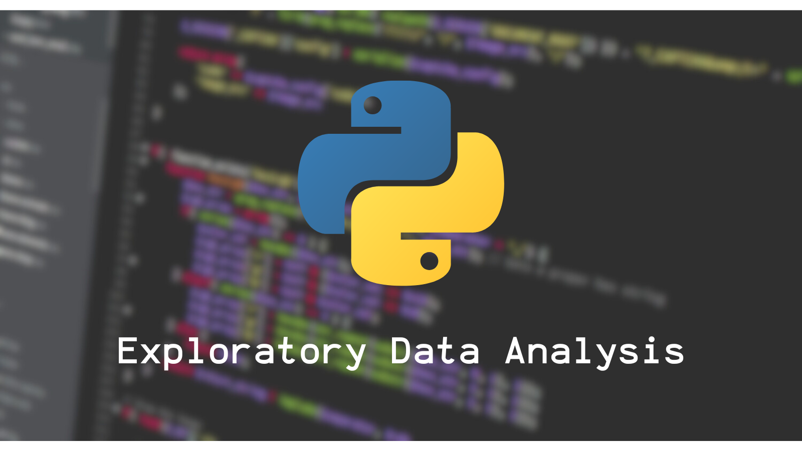

# Exploratory Data Analysis on Oscar Awards Dataset

## Objective
The objective of this project is to explore the Oscar Awards dataset and search for the most nominated from each category. The category that I'm searching is Director, Writer, Film Editor, Production Design, Actor Leading Role, Actor Supporting Role, Actress Leading Role, Actress Supporting Role, Cinematographer, Music (original score) Composer, Makeup Artist, Sound Editing, Visual Effect Artist.

## Data
The data that I'm using is from Kaggle, The Oscar Award, 1927 - 2023.

Data Source: https://www.kaggle.com/datasets/unanimad/the-oscar-award

## Tools
- Jupyter Notebook for easy documentation 
- Python for Exploratory Data Analysis (data preparation and cleaning, explore, visualize).

## Closing
I appreciate your interest in my project repository. I am open to any feedback, suggestions, or critiques you want to give me as it will increase my documentation skills for my newer projects and my analytical skills on data.

Feel free to reach me out 

  - Email: findisel.joshua@gmail.com
  - Linkedin: https://www.linkedin.com/in/joshua-findisel-pangaribuan/
